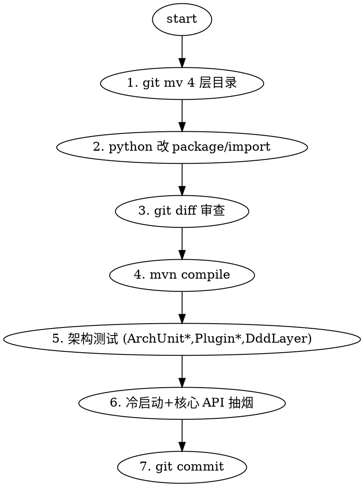

# Phase 3.5 DDD 物理包重组 Implementation Plan

> **For Claude:** REQUIRED SUB-SKILL: Use superpowers:executing-plans to implement this plan task-by-task.

**Goal:** 把 4 个教育特定领域 (`student` / `academic` / `teaching` / `calendar`) 从 `domain/`、`application/`、`infrastructure/persistence/`、`interfaces/rest/` 迁到 `infrastructure/extension/plugins/education/` 之下，让 `domain/` 只剩 4 个通用包 (`access` / `organization` / `place` / `shared`)，并加 ArchUnit 规则守护。

**Architecture:** 每个领域 4 层 (domain/application/infrastructure/interfaces) 整体迁到 `plugins/education/{layer}/{pkg}/`。用 `git mv` 保留 blame 历史。用 Python literal-replace 脚本做 260 个 package 声明 + 314 条内部 import 的机械改写 (非 sed 非 regex，纯 `str.replace`，git diff 可审计)。外部 5 个引用者用 Edit 工具精修。

**Tech Stack:** Java 17, Maven, JdbcTemplate/MyBatis Plus (PO 扫包路径需确认)，ArchUnit 1.x。

---

## 迁移清单

| 领域 | Java 文件 | LOC | 外部引用者 | 内部 import | 备注 |
|---|---:|---:|---:|---:|---|
| calendar | 39 | 2051 | 0 | 43 | 最干净, 先做 |
| teaching | 102 | 9992 | 0 | 111 | 文件多但无外部耦合 |
| academic | 57 | 5197 | 2 | 73 | student 里有 2 个文件引用 |
| student | 62 | 8848 | 3 (+1 test) | 87 | 最复杂, 最后做 |
| **合计** | **260** | **26088** | **5 + 1test** | **314** |  |

## 无交叉依赖 (核对结论)

- 4 个领域彼此 `import 0` 次 — 迁一个不会牵连另一个
- 都只依赖 `domain/shared` (不动)
- MyBatis XML 0 改动 (本仓唯一 XML 是 `OrgUnitMapper.xml`, 与 4 领域无关)
- `plugins/education/` 目标目录 domain/application/infrastructure/interfaces 子目录都空，可直接 mv 进去

## 外部引用者 (5 个 + 1 test, 迁移后需改)

```
application/academic/GradeMajorDirectionApplicationService.java   ← 引 student
application/events/StudentEventHandler.java                       ← 引 student
application/myclass/MyClassApplicationService.java                ← 引 student
infrastructure/persistence/student/CohortOpenedDirectionRepositoryImpl.java ← 引 academic  (自己会先跟 student 一起走)
interfaces/rest/student/SchoolClassController.java                ← 引 academic  (同上)
test/application/student/StudentApplicationServiceTest.java       ← 引 student (测试, 跟 student 一起走)
```

实际在 "别人" 里的仅 3 个 (application/academic, events, myclass)。

## 配置侧扫包路径需确认

- `@MapperScan` / `@ComponentScan` / `@EntityScan` 有没有写 `com.school.management.domain.student` 这种显式路径? 需扫 SpringBootApplication 启动类和 `config/` 包确认。
- MyBatis PO 的 `@TableName` 不涉及包路径, 不用改。
- Casbin / Druid 无 Java 包路径配置。

**验证步骤**: migrate 前 grep `basePackages` / `basePackageClasses` / `@MapperScan`。

---

## 工作流 (每包 1 commit)



### 机械改写脚本 (Python literal-replace)

保存为 `scripts/phase35-rewrite.py` (一次性工具, 用完可删):

```python
#!/usr/bin/env python3
"""Phase 3.5 literal-string rewriter — 非 sed 非 regex, 纯 str.replace."""
import sys, os
from pathlib import Path

# 用法: python phase35-rewrite.py <pkg>  其中 <pkg> ∈ {calendar,teaching,academic,student}
ROOT = Path("backend/src")
OLD_PREFIXES = [
    "com.school.management.domain.{pkg}",
    "com.school.management.application.{pkg}",
    "com.school.management.infrastructure.persistence.{pkg}",
    "com.school.management.interfaces.rest.{pkg}",
]
NEW_PREFIX_MAP = {
    "com.school.management.domain.{pkg}":
        "com.school.management.infrastructure.extension.plugins.education.domain.{pkg}",
    "com.school.management.application.{pkg}":
        "com.school.management.infrastructure.extension.plugins.education.application.{pkg}",
    "com.school.management.infrastructure.persistence.{pkg}":
        "com.school.management.infrastructure.extension.plugins.education.infrastructure.persistence.{pkg}",
    "com.school.management.interfaces.rest.{pkg}":
        "com.school.management.infrastructure.extension.plugins.education.interfaces.rest.{pkg}",
}

def main(pkg):
    changed = 0
    for p in ROOT.rglob("*.java"):
        src = p.read_text(encoding="utf-8")
        orig = src
        for old in OLD_PREFIXES:
            o = old.format(pkg=pkg)
            n = NEW_PREFIX_MAP[old].format(pkg=pkg)
            src = src.replace(o, n)
        if src != orig:
            p.write_text(src, encoding="utf-8")
            changed += 1
    print(f"[phase35] {pkg}: rewrote {changed} files")

if __name__ == "__main__":
    main(sys.argv[1])
```

**关键性质**:
- 仅 `str.replace(old, new)` — literal match, 无通配符, 无回溯
- 搜索全仓库 `.java` — 包括刚 git mv 过去的新位置 + 未迁走的外部引用者
- `git diff` 可完整审查每一处改动
- 无副作用 (不动注释/字符串/resource)

---

### Task 1: calendar 迁移

**Files (git mv 整目录)**
- `domain/calendar/` → `infrastructure/extension/plugins/education/domain/calendar/`
- `application/calendar/` → `infrastructure/extension/plugins/education/application/calendar/`
- `infrastructure/persistence/calendar/` → `infrastructure/extension/plugins/education/infrastructure/persistence/calendar/`
- `interfaces/rest/calendar/` → `infrastructure/extension/plugins/education/interfaces/rest/calendar/`

**Step 1: 确认目标父目录存在**

```bash
mkdir -p backend/src/main/java/com/school/management/infrastructure/extension/plugins/education/{domain,application,infrastructure/persistence,interfaces/rest}
```

**Step 2: git mv 4 层**

```bash
cd backend/src/main/java/com/school/management
git mv domain/calendar                    infrastructure/extension/plugins/education/domain/calendar
git mv application/calendar               infrastructure/extension/plugins/education/application/calendar
git mv infrastructure/persistence/calendar infrastructure/extension/plugins/education/infrastructure/persistence/calendar
git mv interfaces/rest/calendar           infrastructure/extension/plugins/education/interfaces/rest/calendar
```

**Step 3: Python 改 package / import**

```bash
python scripts/phase35-rewrite.py calendar
```

**Step 4: git diff 审查**

```bash
git diff --stat | head -20
# 期望: 39 个 moved 文件 (package 改) + 0 个 外部引用者 (calendar 无外部)
```

**Step 5: mvn compile**

```bash
cd backend
JAVA_HOME=... mvn -q compile
# 期望: BUILD SUCCESS, 无 package does not exist 错误
```

**Step 6: 架构测试**

```bash
mvn -q test -Dtest="ArchUnit*,Plugin*,DddLayerTest,SemVerTest,UnifiedPluginPackageTest"
# 期望: 49+/49+, 0 failures
```

**Step 7: 提交**

```bash
git add -A  # 包括 mv + rewrite 结果
git commit -m "refactor(phase35): 迁 calendar 到 plugins/education (39 files)"
```

---

### Task 2: teaching 迁移

同 Task 1 结构, package=teaching。
- git mv 4 层目录
- python scripts/phase35-rewrite.py teaching
- compile + arch test
- commit

特别检查: teaching 下 102 文件, 是 4 包里最大的。compile 失败时先看是不是漏了某个 `import` 目标 (脚本只改 `com.school.management.{layer}.teaching` 开头的, 如果代码里写了这个路径的字符串 (比如注解的 `basePackages`), 不会被改)。

---

### Task 3: academic 迁移 + 2 个外部引用修复

**git mv + python rewrite**: 同 Task 1。

**外部引用校验**: 脚本跑完应该把以下 2 个文件的 `import com.school.management.domain.academic...` 也改到新位置 (脚本搜全仓库):
- `infrastructure/persistence/student/CohortOpenedDirectionRepositoryImpl.java`
- `interfaces/rest/student/SchoolClassController.java`

**git diff 重点看这 2 个文件是否正确。**

---

### Task 4: student 迁移 + 3 个外部引用 + 1 test

**git mv + python rewrite**: 同 Task 1, package=student。

脚本将自动处理:
- 3 个 application 外部引用 (application/academic/GradeMajorDirectionApplicationService, application/events/StudentEventHandler, application/myclass/MyClassApplicationService) 中的 `import com.school.management.domain.student...`
- 1 个测试 `test/application/student/StudentApplicationServiceTest.java` — 但该测试本身也被 `application/student/` 整目录迁走

注意: academic 迁过一轮后, `infrastructure/persistence/student/CohortOpenedDirectionRepositoryImpl.java` 和 `interfaces/rest/student/SchoolClassController.java` 还在 student 子树里, 此 Task 会一起迁走。

---

### Task 5: 加 ArchUnit domain/ 允许清单规则

**Files:**
- Modify: `backend/src/test/java/com/school/management/architecture/ArchUnitPluginArchitectureTest.java`

**Step 1: 追加规则**

```java
@Test
void domain_package_must_only_contain_generic_subpackages() {
    // Phase 3.5 结束后, domain/ 只允许 4 个通用包 + shared
    // 教育特定 (student/academic/teaching/calendar) 已迁到 plugins/education/domain/
    ArchRule rule = noClasses()
            .that().resideInAPackage("..domain..")
            .should().resideInAnyPackage(
                "..domain.student..",
                "..domain.academic..",
                "..domain.teaching..",
                "..domain.calendar.."
            );
    rule.check(classes);
}
```

**Step 2: 运行测试**

```bash
mvn -q test -Dtest=ArchUnitPluginArchitectureTest
# 期望: 14 tests (13 + 新 1), 0 failures
```

**Step 3: commit**

---

### Task 6: 最终 Gate 1 + Gate 2

**Gate 1: 完整架构测试**
```bash
mvn -q test -Dtest="ArchUnit*,Plugin*,DddLayerTest,SemVerTest,UnifiedPluginPackageTest,NoMagicTriggerStringTest"
# 期望: 50+ 全绿
```

**Gate 2: 冷启动 + API 抽烟**
- kill java
- 启动 backend
- 期望: Started StudentManagementApplication / 310 perms / 15 roles / 32 types
- login + `/api/plugin-platform/overview` 数据一致
- 抽一个业务 API: `/api/students/list` 或 `/api/teaching/schedule/my` 返回 200

**Gate 3: 更新 docs/plugin-architecture-status.md**
- Phase 3.5 移到已完成
- A+ 进度 13/15 → 14/15 (93%)

---

## 风险与应对

| 风险 | 概率 | 应对 |
|---|---|---|
| SpringBootApplication 有 `basePackages={"com.school.management"}` 通配 | 低 | 大概率通配到整个 com.school.management, 不需改 |
| 某配置类 `@MapperScan("com.school.management.infrastructure.persistence")` | 中 | 需改为覆盖 plugins 子树: 用 `com.school.management` 通配 或显式加新路径 |
| ArchUnit noClass 规则和现有规则冲突 | 低 | 独立规则, 先预见 fail → fix → assert |
| 脚本替换误伤 (如注释里写了旧包名) | 低 | literal 精确替换, 包名前后有 `.` 分界, 注释里写的也应一并更新 (语义上可接受) |
| 某文件用 fully-qualified name (无 import) | 极低 | 脚本搜全文, 包括代码内引用 |
| Casbin policies 存有旧包名 (不太可能) | 极低 | DB 里是资源/权限码, 与 Java 包无关 |

## 回滚

- 如某 Task 失败: `git reset --hard <该 Task 开始前的 commit hash>`
- Phase 3.5 的所有改动都是原子 commit, 每包独立可回

---

**计划就绪。接下来按 Task 1~6 依次执行, 每个 Task 结束 git commit。**
